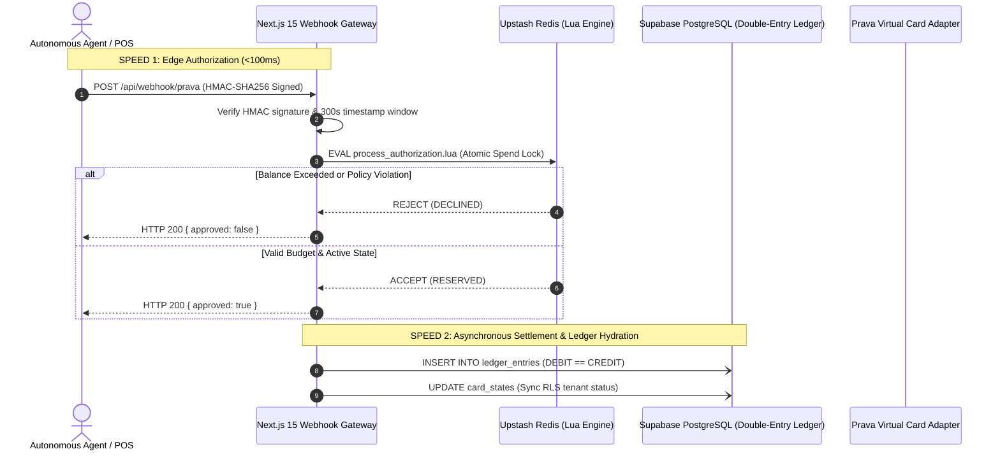

# 💳 VAPOR: Autonomous Corporate Card & Spend Governance Engine

> **Two-speed financial execution engine combining sub-100ms atomic Redis Lua authorizations with immutable PostgreSQL double-entry ledgers.**

[](tests/)
[](https://nextjs.org)
[](https://www.typescriptlang.org)
[](https://supabase.com)
[](https://upstash.com)

---

## 🌟 What It Does

VAPOR is a high-reliability corporate card issuance and spend governance engine designed for autonomous AI agents and developer teams. It provides sub-100ms authorization decisions at checkout using atomic Redis Lua scripts while maintaining mathematical precision with integer minor units (`centsMath`) and storing all transactions in an immutable double-entry accounting ledger on Supabase PostgreSQL.

---

## 🎯 Why It Exists (The Problem)

1. **Floating-Point Rounding Exploits:** Standard JavaScript/Python `Number` types introduce IEEE 754 floating-point inaccuracies (`0.1 + 0.2 = 0.30000000000000004`), which can accumulate or be exploited in automated transaction pipelines.
2. **Double-Spend Race Conditions:** When concurrent AI agents make simultaneous API calls against a shared card balance, standard database read-then-write patterns can allow over-spending before balances update.
3. **Audit Immutability:** Many modern spend tools mutate balance fields in-place, destroying forensic auditability required for financial reconciliation.

---

## 🏗️ Two-Speed Architecture



---

## 🔒 Core Financial Invariants

| Invariant | Implementation Mechanism | Verification |
|---|---|---|
| **Zero Float Arithmetic** | Strict integer minor units with `BigInt` splitting in `centsMath.ts` (`toCents`, `toDollars`, `addCents`, `subtractCents`) | Verified (8 unit tests) |
| **Atomic Concurrency** | Single-cycle Redis script execution (`process_authorization.lua`) preventing concurrent double-spends | Verified (3 concurrency tests) |
| **Double-Entry Balance** | SQL database check constraint `amount > 0` and application assertion `DEBIT == CREDIT` | Verified (3 integration tests) |
| **Webhook Replay Defense** | Constant-time HMAC-SHA256 comparison and 300-second timestamp drift rejection | Verified (7 unit tests) |
| **Multi-Tenant Isolation** | PostgreSQL Row-Level Security (RLS) bound to `organization_id` | Verified in schema |
| **Role-Based Access Control** | Role hierarchy (`OWNER`, `FINANCE_ADMIN`, `APPROVER`, `EMPLOYEE`, `AUDITOR`) in `rbac.ts` | Verified in domain auth |

---

## 📂 Repository Structure

```
V4P0R/
├── src/
│   ├── domain/                  # Pure business rules (zero external dependencies)
│   │   ├── budget/centsMath.ts  # Integer minor-units financial math
│   │   ├── policy/              # Spend rules, velocity limits, MCC filters
│   │   ├── transaction/         # Card lifecycle state machine
│   │   └── auth/rbac.ts         # Role-based permissions
│   ├── infrastructure/          # External service integrations
│   │   ├── redis/               # Atomic Lua scripts (process_authorization.lua)
│   │   ├── database/            # Supabase PostgreSQL client & queries
│   │   └── security/            # HMAC-SHA256 signature verification
│   ├── adapters/                # Card provider drivers (Prava, Linq)
│   └── app/api/                 # Next.js 15 App Router HTTP endpoints
├── migrations/                  # Idempotent PostgreSQL schema migrations
│   ├── 001_initial_schema.sql
│   └── 002_sandbox_pilot_schema.sql
├── tests/                       # 66 Automated Vitest Tests
│   ├── unit/                    # centsMath, stateMachine, hmacValidator, policyEvaluator
│   └── integration/             # sandboxPilot, pravaAdapter, backendSealed
├── vitest.config.ts
└── package.json
```

---

## 🧪 Automated Testing & Verification

VAPOR includes 66 unit and integration tests executing under Vitest:

```bash
# 1. Install dependencies
npm install --legacy-peer-deps

# 2. Run test suite
npm test
```

### Verified Test Run Output:
```text
 ✓ tests/unit/centsMath.test.ts (8 tests)
 ✓ tests/unit/policyEvaluator.test.ts (6 tests)
 ✓ tests/unit/hmacValidator.test.ts (7 tests)
 ✓ tests/unit/stateMachine.test.ts (30 tests)
 ✓ tests/unit/authorizationEngine.test.ts (3 tests)
 ✓ tests/unit/config.test.ts (3 tests)
 ✓ tests/integration/sandboxPilot.test.ts (3 tests)
 ✓ tests/integration/pravaAdapter.test.ts (3 tests)
 ✓ tests/integration/backendSealed.test.ts (3 tests)

 Test Files  9 passed (9)
      Tests  66 passed (66)
   Duration  3.67s
```

---

## 🚀 Running Locally

```bash
# Set environment variables
cp .env.example .env

# Start Next.js development server
npm run dev
# Server listening on http://localhost:3000
```

---

## 📊 Current Status & Roadmap

- **Status:** `Controlled Sandbox Pilot (v1.0.0)` — Core ledger, Redis Lua scripts, HMAC validation, and card adapters fully functional and verified.
- **Roadmap:**
  - [ ] PCI-DSS v4.0.1 tokenization compliance audit with third-party QSA.
  - [ ] AWS KMS / HashiCorp Vault hardware enclave key management.
  - [ ] Multi-region PostgreSQL read-replicas for sub-10ms global edge reads.

