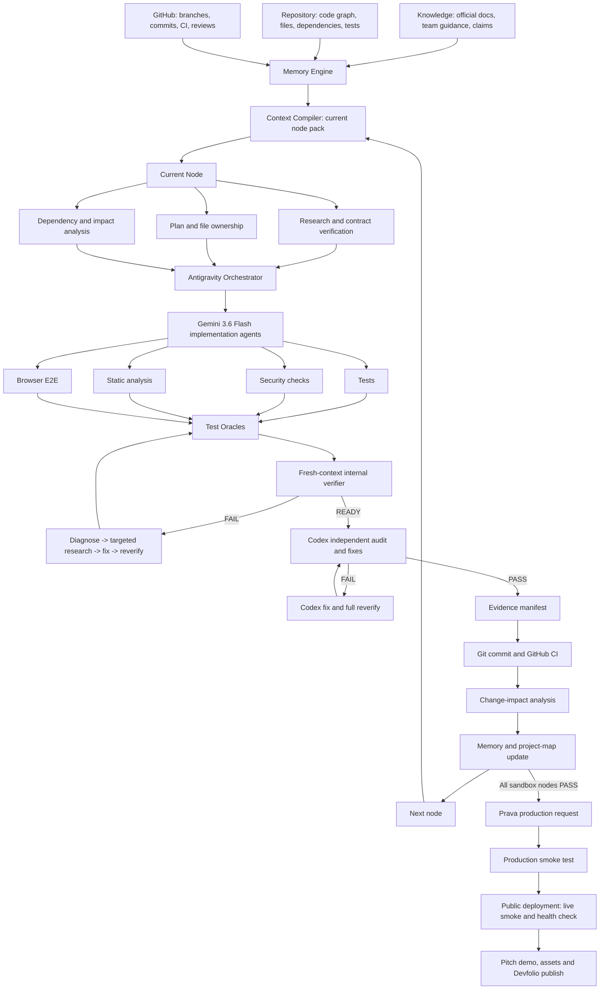

# VAPOR Engine — Time-Boxed Multi-Agent Workflow

## Final sequence

`Antigravity sandbox build -> Codex independent verify/fix -> Prava production request -> production smoke test -> demo -> submission`

Production access is expected shortly after the verified sandbox proof; it is intentionally requested after Codex signs the sandbox build.

The demo and submission are release deliverables. Deploy a public judge URL during integration, verify it in a fresh browser context without team access, and reserve the final 90 minutes for assets and publish—not feature work.

## System graph

## Time budget from start of full execution

| Window | Outcome |
|---|---|
| 0:00–0:20 | Load skills, create state/project map, correct N0 truth manifest, freeze account-enabled contracts. |
| 0:20–1:00 | Prove the Prava feasibility slice: product, approval/mandate, one-time card, automatable merchant checkout and expected sandbox decline. |
| 1:00–3:15 | Parallel implementation: Prava checkout; Linq/Senso; product UI; auth/data/release foundation. |
| 3:15–4:00 | Integrate branches, resolve contract/state boundaries, deploy preview. |
| 4:00–4:45 | Antigravity internal test-oracle and browser-verifier pass. |
| 4:45–6:00 | Codex independent audit, fixes and full reverification. |
| 6:00–6:15 | Send Prava production request with redacted sandbox proof. |
| 6:15–6:45 | Configure isolated production credentials and run bounded smoke test after access arrives. |
| 6:45–7:45 | Record and edit demo. |
| 7:45–8:30 | Complete and verify submission. |
| Remaining time | Retry/buffer; no new features. |

## Workstream ownership

| Workstream | Owns | Must not own |
|---|---|---|
| Prava checkout | Prava adapter/orchestrator, token handoff, merchant Playwright automation, provider evidence | Auth, Linq/Senso, global migrations |
| Partner experience | Senso retrieval/evidence, Linq messaging/webhooks/approval | Prava token handling, package lock |
| Product UI | Request, evidence, approval, checkout/result, audit timeline | Provider secrets, schema migrations |
| Trust/data/release | Auth/membership, canonical migrations, durable workflow, CI/config/observability | UI styling, merchant automation |
| Verifier | Tests, static/security review, browser assertions, evidence verdict | Feature implementation until a specific FAIL is assigned |

## Node completion protocol

1. Define observable test oracles before code.
2. Run implementation in an isolated branch/worktree.
3. Return raw evidence, not a completion narrative.
4. Integrate only after focused verification; use local checkpoint commits when needed to merge isolated worktrees.
5. A fresh-context internal verifier returns FAIL or READY.
6. Codex returns final sandbox PASS only after independent test/fix/retest.
7. Final node/release commit, CI, impact analysis, and memory update require independent PASS and unlock the next node.

## Prava sandbox oracle

PASS requires a real product decision, exact approval/mandate, Passkey approval, one-time card issuance, end-merchant checkout attempt, expected sandbox decline, and redacted trace linking the states. Do not store or capture the one-time PAN/CVV.

## Cut policy

Cut analytics, extra merchants, broad dashboards, secondary policy types, and decorative UI first. Do not cut the Prava sandbox oracle, user-visible end-to-end result, core security boundary, independent verification, demo recording, or submission buffer.

## Final submission operating rule

At least 90 minutes before the deadline, freeze feature work. Use that window for public deployment verification, screenshot/redaction review, a short pitch demo and YouTube upload, then Devfolio publication/status check. If the product is not ready, submit the strongest truthful working slice with clear limits; never delay publishing for cosmetic work.

## Production and submission gates

- Request production only after Codex sandbox PASS.
- Keep sandbox and production secrets/config/evidence separate.
- Production smoke test must be bounded to the approved merchant/amount and require explicit user approval for a real consequential transaction.
- Demo may show sandbox expected-decline proof and production-safe status; never expose payment credentials.
- Before recording, open the public product URL in a fresh browser context without team credentials and prove the judge can start the intended flow.
- The first screenshot must be the strongest product cover; capture separate request, approval/evidence, and checkout-result screens.
- The final Devfolio description and challenges are human-written, concise, factual, and supported by `docs/DEVFOLIO_SUBMISSION_BRIEF.md`; no invented traction, payment success, integration, or security claim.
- Publish the Devfolio project and explicitly check its status reads `Submitted`; saved draft is not a submission.
