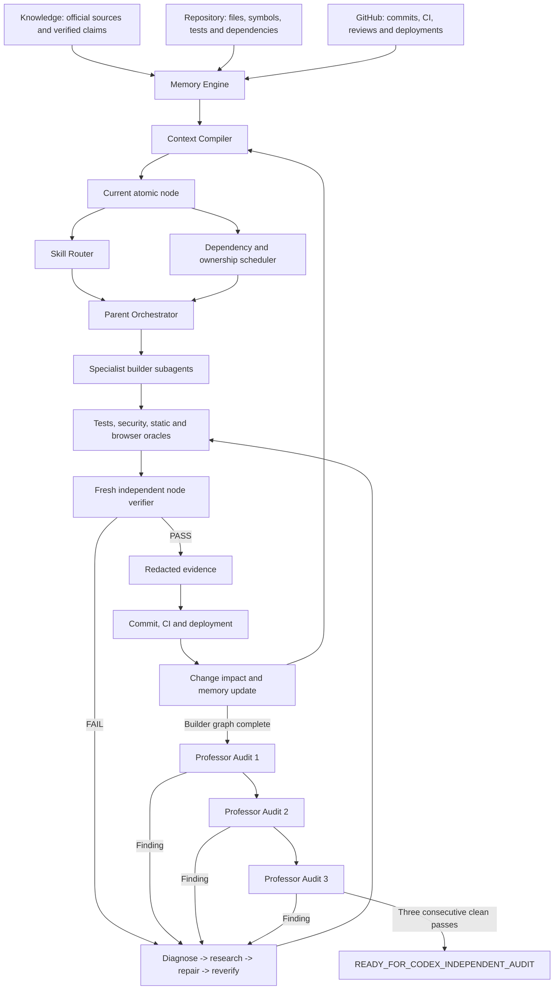

# VAPOR Master Execution System

Status: **authoritative execution contract; graph not yet executed**  
Authority date: 2026-08-02  
Supersedes: `plans/03-antigravity-execution-contract.md`, `plans/04-vapor-engine-workflow.md`, `plans/05-authoritative-complete-graph.md`, and `plans/06-production-graph-execution-system.md` wherever they conflict.

## 1. Mission and terminal outcome

Antigravity is VAPOR's autonomous implementation system. It must take the current repository from its measured truth baseline through implementation, real sandbox integrations, security, tests, public deployment, operations readiness, and three fresh-context audits.

The only successful Antigravity terminal state is:

`READY_FOR_CODEX_INDEPENDENT_AUDIT`

That state is permitted only when every mandatory pre-Codex graph node is `PASS`, every required artifact is present and current, no pre-Codex input remains unresolved, the real Prava sandbox golden path is proven, the public product is live, and three consecutive independent professor audits are clean. The G20-only `CODEX_INDEPENDENT_PASS` input remains intentionally pending until the user later starts Codex review.

Antigravity must not invoke Codex. The user invokes Codex after receiving the handoff package. A real consequential production payment and the final Devfolio submission remain human approval gates.

## 2. Product and market contract

VAPOR is a **US-first, globally extensible autonomous procurement and spend-control platform for startups and small finance teams**.

The golden flow is:

`purchase intent -> AI/Senso discovery evidence -> deterministic policy -> Linq human approval -> Prava purchase permission -> one-time card -> end-merchant checkout attempt -> expected sandbox decline -> redacted durable audit result`

The release path may never replace a provider result with a random, offline, hard-coded, or synthetic success. A demo preset may prefill an intent; it must still execute the real sandbox flow.

## 3. Authority and source precedence

Use this precedence for every decision:

1. Account-specific written provider guidance supplied by the user.
2. Current official provider documentation and installed SDK types.
3. Safe live sandbox responses from the configured account.
4. This approved master execution contract and graph source.
5. Current repository source and verified tests.
6. Historical plans and AI memory.

Never combine incompatible provider flows. Unknown contract behavior creates a contract-research node; it never authorizes an invented field, endpoint, state, or fallback.

## 4. Autonomy and the two human gates

Antigravity is authorized to research, install vetted skills, edit code, add tests, run commands, create isolated worktrees, commit, push, open or update pull requests, call sandbox providers, deploy preview/production-safe builds, run public smoke tests, record demo assets, and prepare submission materials.

Only these actions require fresh user approval:

- `H_PRODUCTION_PAYMENT`: immediately before a real consequential production purchase/payment.
- `H_FINAL_SUBMISSION`: immediately before publishing the final Devfolio submission.

Each approval is single-use, named-human, unexpired, immutable, and bound to the exact gated node, current graph hash, source snapshot, action scope, and approval evidence. Atomically reserve and consume it immediately before the one authorized action; no retry is authorized. Any material change, scope mismatch, expiry, prior consumption, or uncertain result invalidates it; never infer, broaden, renew, or retry from an old approval.

Credential or external-access requests are inputs, not approval gates. Record them in the missing-input registry and continue every independent ready node.

## 5. Execution architecture



## 6. Hierarchical graph contract

The immutable registry is generated from `orchestration/graph-source.json` by `scripts/vapor-graph.mjs`. The expanded graph must contain at least 5,000 meaningful atomic leaves. Count padding, duplicate requirements, disconnected leaves, circular dependencies, and unreachable nodes are validation failures.

Hierarchy:

- L0: mission and release gates.
- L1: outcome workstreams G00-G20.
- L2: concrete capabilities.
- L3: research, design, implementation, verification, and review packages.
- L4: one falsifiable source, code, test, security, browser, deployment, or evidence assertion.

Repeated quality dimensions are allowed only when they test different concrete capabilities. They are not duplicate nodes: for example, replay protection for a Prava webhook and replay protection for a Linq webhook have different contracts, owners, inputs, code, and evidence.

Every graph path must be reachable from `VAPOR.ROOT` and must reach the terminal release path. Outcome completion gates aggregate every mandatory descendant before unlocking successors.

## 7. Atomic node contract

Every executable L4 node must contain:

```yaml
id: stable hierarchical identifier
parent: L3 package identifier
outcome: G00 through G20
capability: concrete L2 capability
kind: research | design | implementation | test | security | browser | deploy | evidence | audit | human
requirement: one unique falsifiable sentence
sources: approved human decision, official URL, or repository path
owner_role: one role from orchestration/roles.json
required_skills: relevant skills only
depends_on: accepted predecessor node IDs
write_scope: explicit paths or read-only
oracle: machine-observable command/assertion or bounded manual observation
evidence_path: redacted artifact destination
human_gate: NONE | H_PRODUCTION_PAYMENT | H_FINAL_SUBMISSION
status: graph state
```

A node with no source, oracle, owner, skills, dependency path, or evidence destination is `UNSPECIFIED` and cannot execute.

## 8. State machine

Allowed states:

`LOCKED -> READY -> RUNNING -> VERIFYING -> PASS`

Recovery states:

- `WAITING_INPUT`: a named credential, access, decision, or external artifact is missing.
- `RETRYING`: a bounded transient retry is in progress.
- `FAILED_DIAGNOSIS`: an oracle failed and a new diagnosis is required.
- `REVALIDATE`: accepted evidence became stale after an upstream change.
- `FAIL`: the current implementation does not satisfy its oracle.

Rules:

- `WAITING_INPUT` pauses only descendants that require that input.
- A failed or waiting branch never blocks unrelated `READY` nodes.
- `PASS` requires current evidence and a verifier different from the implementer.
- Upstream contract, schema, state-machine, security-boundary, or dependency changes move every affected `PASS` node to `REVALIDATE`.
- The parent orchestrator may not turn a missing command, absent test, or unavailable provider into `PASS` or `NOT_APPLICABLE` merely to improve coverage.
- `BLOCKED` is not a normal graph state. Use it only in the final report for a genuinely non-resumable external impossibility after alternatives are exhausted.

## 9. Missing-input manager

Record every missing item in `orchestration/missing-inputs.json` with:

- stable ID and environment-variable/service name;
- why it is required and how to obtain it;
- secure destination where the user must place it;
- dependent node IDs;
- safe validation method that never prints the value;
- status `MISSING`, `PROVIDED_UNVERIFIED`, `VERIFIED`, or `REJECTED`;
- timestamps and redacted evidence.

Never put a secret value in source, plans, graph files, prompts, logs, screenshots, evidence, or Git. Continue independent work, present missing items as one consolidated checklist, then automatically resume waiting nodes after safe validation.

## 10. Roles and responsible-agent behavior

`orchestration/roles.json` defines the parent, specialists, reviewers, auditors, release controller, and missing-input manager. Every assigned agent operates as a PhD-level principal specialist with 30+ years equivalent professional judgment. This persona is an accountability standard, not evidence of capability.

Every role must:

- challenge contradictions and physically, legally, or technically impossible requests;
- distinguish facts, inferences, assumptions, and unknowns;
- recommend a better design when evidence supports it;
- reject fake success, unsupported APIs, hidden manual steps, and unsafe shortcuts;
- report residual risk even when its own work passes;
- never approve its own implementation.

## 11. Skill router and skill discovery

`orchestration/skill-router.json` maps work profiles to mandatory skills. Before a node enters `RUNNING`, its agent must read every selected skill completely and record the selected skill names in the context pack.

If a capability is missing:

1. Search installed skills, including the user's Antigravity skill inventory.
2. Use the installed `find-skills` workflow when available.
3. Search Skills.sh for a relevant prebuilt skill.
4. Inspect source, instructions, scripts, permissions, network behavior, and supply-chain risk before installation.
5. Pin the selected source/version when possible.
6. If no safe skill exists, create a focused project skill from official sources and validate it before use.

Do not load irrelevant skills. The current-node context pack should remain below roughly 2,000 relevant lines.

## 12. Context compiler and durable memory

For each current node, compile only:

- objective, acceptance oracle, and predecessor evidence;
- assigned role and mandatory skills;
- current official contracts and versions;
- relevant source, symbols, tests, and raw failures;
- exact write scope and forbidden paths;
- security/privacy constraints;
- evidence destination, recovery path, and impact edges.

Durable memory consists of graph state, accepted decisions, contract manifest, project map, missing-input registry, evidence manifests, commits, test results, and change impact. Conversation summaries and agent narratives are never completion evidence.

## 13. Parallel subagents and integration

The parent orchestrator schedules all ready, independent packages concurrently within platform capacity.

- Use isolated worktrees/branches for concurrent writers.
- Assign disjoint files or symbols.
- Serialize migrations, identity, package lock, payment-state transitions, graph source, and shared contracts.
- A contract scout precedes provider implementation.
- An implementer adds or updates tests within its scope.
- A separate reliability reviewer runs positive, negative, timeout, duplicate, race, restart, and redaction oracles as applicable.
- A security reviewer is mandatory for auth, data, provider, payment, browser, deployment, and installed-skill packages.
- The integration reviewer examines diffs and reruns boundary tests before merge.

Out-of-scope findings become new connected graph nodes; they do not authorize random edits.

## 14. Outcome path

The generated registry expands these connected outcomes:

1. G00 control-plane correction and truth baseline.
2. G01 skills, roles, context, memory, and graph mechanics.
3. G02 official contracts, runtime feasibility, and missing inputs.
4. G03 canonical domain, money, state machine, migrations, and durable audit.
5. G04 authentication, authorization, tenancy, RLS, secrets, and abuse boundaries.
6. G05 deterministic policy, approval lifecycle, and first-valid-decision semantics.
7. G06 AI product discovery and meaningful Senso evidence.
8. G07 real Linq message approval and signed Tapback processing.
9. G08 real Prava purchase permission and one-time card flow.
10. G09 isolated end-merchant browser checkout and expected sandbox decline.
11. G10 server orchestration, API contracts, idempotency, and recovery.
12. G11 truthful judge/customer UI and durable audit timeline.
13. G12 complete unit, contract, integration, race, browser, and accessibility tests.
14. G13 security, privacy, payment-data, dependency, and skill-supply-chain hardening.
15. G14 CI/CD, public deployment, observability, resilience, backup, and rollback.
16. G15 clean builder release battery and evidence freeze.
17. G16 Professor Audit 1: architecture, data, auth, and security.
18. G17 Professor Audit 2: providers, runtime, concurrency, and failure recovery.
19. G18 Professor Audit 3: product, deployment, operations, and release claims.
20. G19 handoff package and `READY_FOR_CODEX_INDEPENDENT_AUDIT` gate.
21. G20 post-Codex production access, bounded smoke, demo, and human-approved submission.

G20 is represented so the journey reaches production and submission, but Antigravity must stop at G19 until the user invokes Codex. After Codex PASS, execution may resume at G20. A real production payment and final submission still require their named human gates.

## 15. Real integration gates

The Prava sandbox golden path requires redacted proof of:

1. a real product/merchant decision;
2. exact purchase approval or mandate;
3. required user/Passkey approval;
4. one-time card issuance;
5. checkout attempt on an end merchant;
6. expected test-card or insufficient-funds decline;
7. safe correlation across provider, checkout, VAPOR state, and audit evidence.

Linq must send the real approval message and accept only a signed, correlated, non-expired, first-valid decision from the assigned approver. Senso must return actual retrieval evidence and must never present relevance as fraud probability.

## 16. Product and data invariants

- Derive identity, organization, and role from verified server-side membership.
- Store money as integer minor units plus ISO currency.
- Enforce one canonical purchase state machine and reject invalid transitions.
- Make financial/provider writes atomic, durable, idempotent, and fail closed.
- Use durable unique constraints for event/session replay protection.
- If a ledger ships, enforce atomic balanced posting and append-only corrections; otherwise call it a transaction/audit timeline.
- Keep PAN, CVV, payment tokens, API keys, Passkey material, and unrestricted PII out of storage, logs, traces, screenshots, analytics, prompts, and evidence.
- Render UI state from durable backend/provider state. Label sandbox, production, unavailable, and test states honestly.

## 17. Release battery

Before G15 may pass, execute from a clean environment and preserve exact exit codes for:

```text
clean dependency install
format/lint
strict typecheck
unit and property tests
database/migration/RLS tests
API and provider contract tests
negative authorization and cross-tenant tests
webhook signature/replay/duplicate/race/restart tests
secret and payment-data scan, including Git history
dependency vulnerability and license audit
production build
browser E2E against the deployed public URL
real Prava sandbox merchant checkout proof
Linq and Senso live-safe integration proof
accessibility and responsive checks
performance and bounded concurrency checks
health, observability, backup/restore, and rollback smoke tests
Git diff and artifact-redaction checks
```

A missing command or test becomes an implementation node. Passing tests never prove untested requirements.

## 18. Three-audit repair loop

The three auditors start with fresh context and read the repository, live deployment, contracts, raw evidence, and graph state—not builder summaries.

Audit findings use `orchestration/audit-protocol.json` and include severity, violated source/requirement, reproduction, evidence, affected nodes, required remediation, and revalidation scope.

Any Critical or High finding, any mandatory Medium finding, any fake success, any missing real integration proof, or any stale release artifact sends the graph to:

`REPAIR -> BUILDER_SELF_TEST -> G15 -> G16 -> G17 -> G18`

The clean-pass counter resets to zero after any code, configuration, dependency, migration, provider-contract, deployment, or evidence change. Readiness requires three consecutive clean professor passes.

## 19. Completion and handoff

G19 passes only when:

- every mandatory G00-G18 node is `PASS`;
- zero pre-Codex nodes are `WAITING_INPUT`, `FAIL`, `REVALIDATE`, or stale; the G20-only Codex input may remain `MISSING`;
- zero unresolved Critical/High or mandatory Medium findings remain;
- the public HTTPS product works in a fresh unauthenticated/judge-safe context;
- the real sandbox golden path and partner integrations have redacted evidence;
- the release battery, rollback, health, and observability gates pass;
- all three professor audits are consecutive clean passes;
- the handoff package contains commit SHA, live URL, environment matrix, contract manifest, graph coverage, test outputs, provider correlation IDs, audit reports, risks, and exact post-handoff human actions.

Only then set:

`READY_FOR_CODEX_INDEPENDENT_AUDIT`

Do not claim “bank-grade,” certified compliance, unrestricted production readiness, traction, or successful production payment without the corresponding external evidence.

## 20. Bootstrap

From the repository root:

```powershell
node scripts/vapor-graph.mjs build
node scripts/vapor-graph.mjs validate
node scripts/vapor-graph.mjs summary
node scripts/vapor-graph.mjs ready --limit 25
```

Then execute ready nodes through `$vapor-engine`. The graph registry is immutable generated truth; runtime status belongs in `orchestration/state.json`. Never edit generated graph lines manually.
